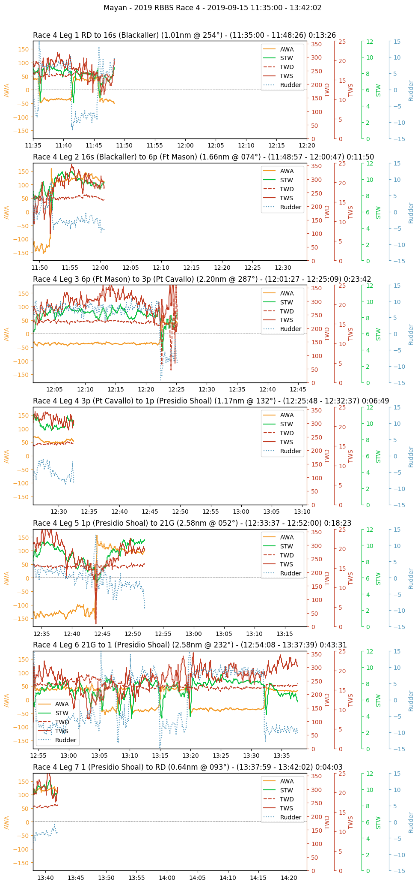
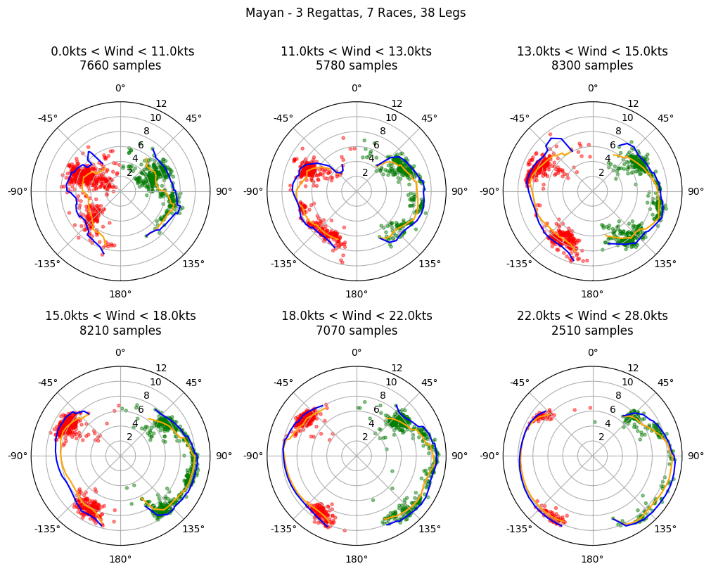
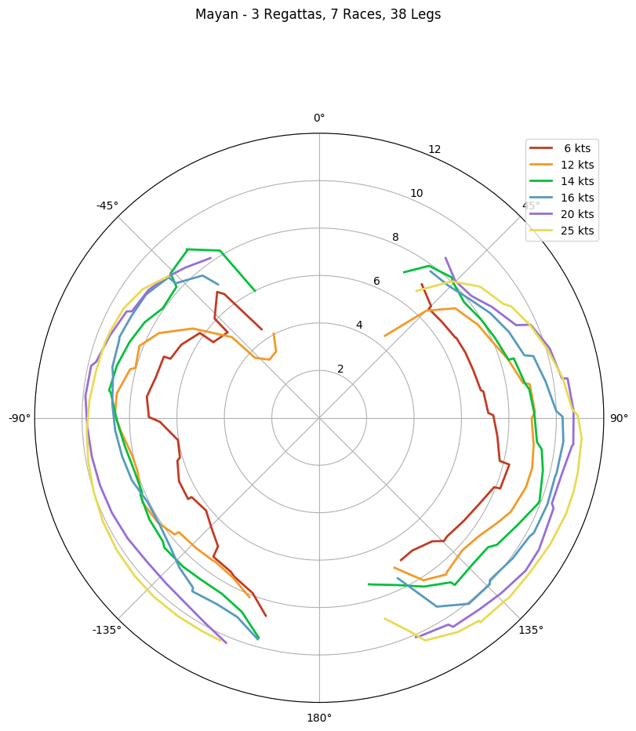

# polarize

Analyze sailboat performance data gathered from NMEA-0183 and NMEA-2000 (N2K) data sources

## Synopsis

- Analyze sailboat race performance using data collected from NMEA bus
- Compute polar plots, per-leg strip charts, minute-by-minute summaries, and Expedition-ready text
- Generate reports in various formats - text files, graphics, and spreadsheets

It has become very easy and relatively inexpensive to record raw NMEA data, for instance:
- Directly via ~$250 Yacht Devices Voyage Data Recorder
- Indirectly via N2K to WiFi gateways (such as any B&G Zeus or Vulcan MFD, Vesper AIS/WiFi gateways, and Yacht Devices YDWG NMEA-2000 dongles) and apps like SEAiq ($5 for iPhone/USA, $50 for Android/World)

polarize takes this data and converts it to more familiar forms - polar charts, strip charts, track files, spreadsheets, etc.

## Configuration

polarize requires two inputs:
1. A list of .json files describing the races and courses in a regatta (typically regatta.json)
2. A per-race NMEA data file pointed to from inside the regatta file
   - .log files are assumed to have raw N2K data
   - .nmea files are assumed to have NMEA-0183 text files

The regatta file contains additional information including boat name, timezone offset, rudder correction, and COG/SOG sources.
Typically one creates a directory for each regatta since they share courses.

## Output

polarize can generate several kinds of output:

Option | Effect
------ | ------
 \-strip | Create per-race strip graph files
 \-legs  | Create per-leg analysis
 \-minute | Create minute-by-minute reports in per-leg analysis
 \-spreadsheet | Create xlsx spreadsheet file
 \-polars | Create aggregate polar graph file
 \-exp | Create aggregate Expedition polar text file
 \-gpx | Create gpx track
 
 Polars can be generated per-regatta or aggregated from multiple regattas (polarize -polars \*/regatta.json)

## Notes

NMEA-0183 .nmea files from SEAiq are parsed directly

NMEA-2000 .log files from Yacht Devices VDR Voyage Data Recorder are converted to
JSON by the canboat analyzer (https://www.github.com/canboat/canboat)

It's becoming common for boats to have multiple sources of similar data. For instance a racing boat
with a B&G MFD and ZG100 GPS/heading sensor will have COG/SOG data from both devices and they will
disagree on COG/SOG due to different damping heuristics, sometimes by quite a bit. If converted to
NMEA-0183 in a WiFi gateway the source is lost making it hard/impossible to filter for only one source.
This will confuse polarize.

Requires Python3.x and additional modules:
- matplotlib for plotting (https://matplotlib.org)
- numpy for some statistics (https://numpy.org)
- scipy for Savitsky-Golay filtering (https://scipy.org)
- xlsxwriter to generate Excel-compatible .xlsx files (https://pypi.org/project/XlsxWriter)

polarize requires kludgey internal configuration:
- The ANALYZE variable must point to the local copy of analyze to enable N2K data conversion
- Polar wind ranges are set manually in a table. The default is good for a particular schooner typical San Francisco Bay wind ranges.

## Example Output

